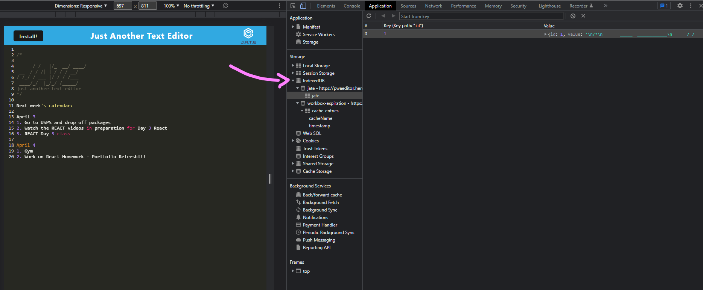

# PWAeditor
A single-page application to create notes or code snippets with or without an internet connection.

[](https://opensource.org/licenses/MIT)

## Description
A text editor that runs in the browser. PWAeditor is a single-page application that meets the PWA criteria and features a number of data persistence techniques that serve as redundancy in case one of the options is not supported by the browser. 
- The application will also function offline.
- The application uses a package called `idb`, which is a lightweight wrapper around the IndexedDB API. 

## Table of Contents
[1. Installation](#installation)

[2. Usage](#usage)

[3. Heroku Link](#heroku-link)

[4. Demo and Screenshots](#demo-and-screenshots)

[5. Contributing](#contributing)

[6. Questions](#questions)

[7. License](#license)

[8. Credits](#credits)

## Installation 
The application has dependencies (see package.json file). Before using the application, install npm modules.

```bash
npm install
```

## Usage 
The application will be invoked by using the following command:

```bash
npm run start dev
```


----------- BELOW IS JUST AN EXAMPLE -------------


```
The social network application enables a user to:
- invoke the application THEN my server is started and the Mongoose models are synced to the MongoDB database
- open API GET routes in Insomnia for users and thoughts THEN the data for each of these routes is displayed in a formatted JSON
- test API POST, PUT, and DELETE routes in Insomnia THEN I am able to successfully create, update, and delete users and thoughts in my database
- test API POST and DELETE routes in Insomnia THEN I am able to successfully create and delete reactions to thoughts and add and remove friends to a user’s friend list


GIVEN a text editor web application
WHEN I open my application in my editor
THEN I should see a client server folder structure
WHEN I run `npm run start` from the root directory
THEN I find that my application should start up the backend and serve the client
WHEN I run the text editor application from my terminal
THEN I find that my JavaScript files have been bundled using webpack
WHEN I run my webpack plugins
THEN I find that I have a generated HTML file, service worker, and a manifest file
WHEN I use next-gen JavaScript in my application
THEN I find that the text editor still functions in the browser without errors
WHEN I open the text editor
THEN I find that IndexedDB has immediately created a database storage
WHEN I enter content and subsequently click off of the DOM window
THEN I find that the content in the text editor has been saved with IndexedDB
WHEN I reopen the text editor after closing it
THEN I find that the content in the text editor has been retrieved from our IndexedDB
WHEN I click on the Install button
THEN I download my web application as an icon on my desktop
WHEN I load my web application
THEN I should have a registered service worker using workbox
WHEN I register a service worker
THEN I should have my static assets pre cached upon loading along with subsequent pages and static assets
WHEN I deploy to Heroku
THEN I should have proper build scripts for a webpack application


* Satisfies all of the above acceptance criteria plus the following:

  * Uses IndexedDB to create an object store and includes both GET and PUT methods

  * The application works without an internet connection

  * Automatically saves content inside the text editor when the DOM window is unfocused

  * Bundled with webpack

  * Create a service worker with workbox that Caches static assets

  * The application should use babel in order to use async / await

  * Application must have a generated `manifest.json` using the `WebpackPwaManifest` plug-in

  * Can be installed as a Progressive Web Application
```

## Heroku Link
[Heroku Link](https://pwaeditor.herokuapp.com/) 

```
PWAeditor:
* is deployed to Heroku at live URL with build scripts
* loads with no errors
* user experience is intuitive and easy to navigate
* user interface style is clean and polished
* resembles the mock-up functionality provided in the Challenge instructions
```

 ## Demo and Screenshots 

1. Demo installing the application from the browser:

    

2. Demo utilizing the browser and the application:

    


3. Image of the brower website and application open at the same time

    

4. Image of IndexedDB

    

5. Image of Manifest

    

6. Image of Service Worker

    

## Contributing 
Contributions are welcomed for future versions with features such as additional enhancements.

For all contributions, please refer to [Contributor Covenant Code of Conduct](https://www.contributor-covenant.org/version/2/1/code_of_conduct/code_of_conduct.md) for contributing guidelines.

## Questions
Interested in seeing my other work?

Check out my GitHub account: [mewing0328](https://github.com/mewing0328).

If you have additional questions, please reach me at [masandraewing@gmail.com](mailto:masandraewing@gmail.com).

## License 
PWAeditor application is covered by MIT license. 

 To view the most current and full license description in opensource.org, click on the license name below.  

 [](https://opensource.org/licenses/MIT)

## Credits
Credit for tutorials and guides I utilized in my code

George Washington University - Coding Bootcamp: Repository Lesson 19-PWA
 - Activity 28-Stu_Mini-Project was the majority of what was utilized for examples

[webpack.js.org](https://webpack.js.org/): Documentation for utilizing webpack


